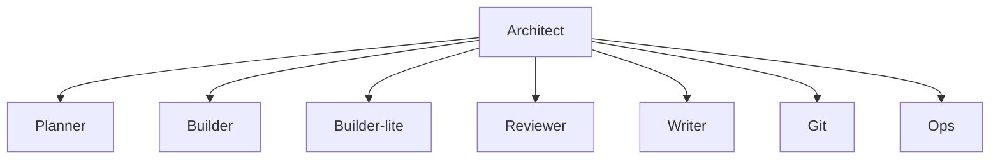
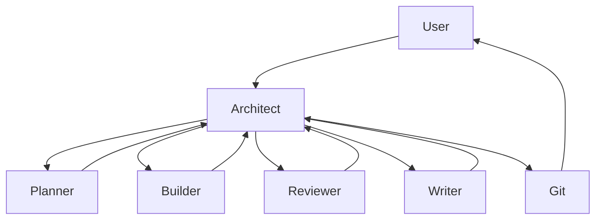
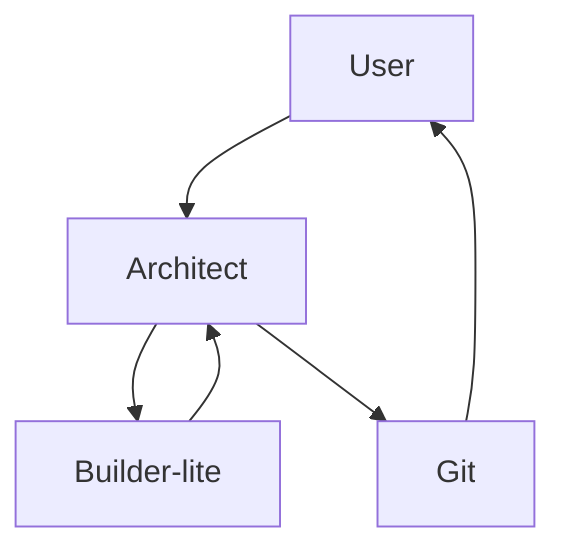
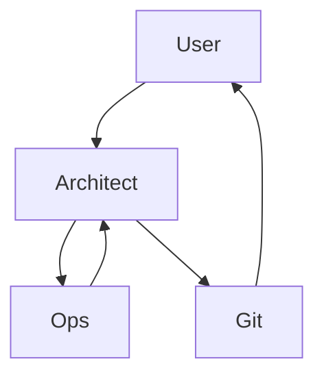

# OpenCode Agent System

## Overview

This is a **custom agent system created by me** for use with OpenCode (the CLI tool).

The system consists of specialized agents that work together under the orchestration of a principal architect. Each agent has a specific role, a dedicated AI model, and well-defined responsibilities. The **Architect** is the single point of entry. It receives requests from the user, analyzes complexity, makes architectural decisions, and delegates work to the most appropriate specialized agents.

## System Architecture



## Agents

| Agent | Model | Role | When to Use |
|-------|-------|------|-------------|
| **architect** | claude-sonnet-4-5 | Principal orchestrator, decision maker | Always the entry point. Analyzes, plans, and delegates. |
| **planner** | claude-opus-4-5 | Planning for complex features | New features, large refactors, architectural changes. |
| **builder** | claude-sonnet-4-5 | Implementation of features and refactors | Complex features, business logic, multi-file changes. |
| **builder-lite** | claude-haiku-4-5 | Simple and mechanical tasks | Typos, minor changes, imports, configuration, planner steps. |
| **reviewer** | claude-opus-4-5 | Specialized code review | Large changes (>200 lines), security-critical code, complex refactors. |
| **git** | claude-haiku-4-5 | Commits with conventional commits | Creating commits, push, branch management. |
| **writer** | claude-haiku-4-5 | ALL documentation and technical writing | README.md, CHANGELOG.md, docs/, analysis, reports, technical markdown. |
| **ops** | claude-sonnet-4-5 | DevOps, infrastructure, cloud | Docker, CI/CD, deploy, servers, cloud resources. |

## Skills

| Skill | Purpose | Used by |
|-------|---------|---------|
| **rioplatense-tone** | Argentine Spanish tone and personality | All agents |
| **conventional-commits** | Strict standard for commit messages | @git |
| **changelog-format** | Keep a Changelog v1.1 standard | @writer |
| **agent-authoring** | Guide for creating and maintaining agents | Meta (reference) |
| **skill-authoring** | Guide for creating and maintaining skills | Meta (reference) |
| **manager-core** | Python CLI framework with fzf menus | Domain-specific |
| **xsi-microservices** | Serverless Go backend with Lambdas | Domain-specific |

## Workflows

### Workflow 1: Complex Feature



**Steps:**
1. User requests a complex feature
2. Architect analyzes and calls Planner
3. Planner generates a detailed plan
4. Architect delegates to Builder for implementation
5. Architect calls Reviewer to validate
6. Architect calls Writer to update documentation
7. Architect calls Git to create commits

### Workflow 2: Quick Fix



**Steps:**
1. User reports a simple bug or typo
2. Architect delegates to Builder-lite
3. Builder-lite executes the fix
4. Architect calls Git to commit

### Workflow 3: Infrastructure Task



**Steps:**
1. User requests infrastructure changes
2. Architect delegates to Ops
3. Ops executes changes (Docker, CI/CD, cloud)
4. Architect calls Git to record changes

## Decision Matrix: Which Agent to Use

```
IF (task < 10 lines AND mechanical) → @builder-lite
ELSE IF (security-critical OR complex logic) → @builder
ELSE IF (user says "quick fix") → @builder-lite
ELSE IF (affects multiple files) → @builder
ELSE IF (doubt) → @builder (safer option)
```

### Decision Examples

| Request | Agent | Reason |
|---------|-------|--------|
| "Fix the typo on line 42" | @builder-lite | Mechanical, < 5 lines |
| "Implement login with JWT" | @builder + @planner | Complex logic, security-critical |
| "Add a logout button" | @builder-lite | Simple UI, follows existing pattern |
| "Refactor the sync system" | @builder + @planner | Multiple files, architecture |
| "Deploy to AWS" | @ops | Infrastructure |
| "Update the README" | @writer | Official documentation |
| "Write me an auth analysis" | @writer | Technical document |

## Critical Rules

### Rule 1: Architect is the Single Entry Point

The user ALWAYS talks to @architect. The architect analyzes, decides, and delegates. The architect NEVER executes code directly.

### Rule 2: Mandatory Delegation

When the user says "do X" or "fix Y", the architect INTERPRETS it as an order to DELEGATE:

- "Make a commit" → Delegate to @git
- "Fix this bug" → Delegate to @builder
- "Deploy this" → Delegate to @ops
- "Update the docs" → Delegate to @writer
- "Write me an analysis" → Delegate to @writer

**EXCEPTION:** Only act directly if the user explicitly says "Without using agents" or "Do it yourself".

### Rule 3: Confirmation for Destructive Actions

Before executing ANY destructive/irreversible action, the architect MUST ask for confirmation:

**Destructive actions:**
- `git reset`, `git revert`, `git push --force`
- `rm`, `rmdir`, `rm -rf`
- Overwriting files without reading first
- `DROP TABLE`, `DELETE FROM`
- `docker system prune`, `docker rm -f`

**Confirmation format:**
```
I will execute: [exact command]

WARNING: This action is destructive/irreversible.
Confirm?
```

### Rule 4: Plan Persistence

When @planner generates a plan, the architect MUST save it:

1. Save the plan to `.claude/current-plan.md`
2. Reference the plan when delegating to @builder
3. Archive the plan after completion: `.claude/archive/plan-FEATURE-YYYYMMDD.md`

### Rule 5: Confirmation of Changes Before Commit

Before @git creates a commit, the architect MUST:

1. Review the changes: `git status` and `git diff`
2. Confirm with the user if there are unexpected changes
3. Only then delegate to @git

## Important Notes

- The **Architect** is the brain, not the hands. It never executes code directly.
- Agents are **specialized**. Each one is an expert in their domain.
- **Skills** provide context and standards to agents.
- **Plans** are persistent and reusable.
- **Delegation** is mandatory. No exceptions (except consulting).
- **Costs** are approximate. They vary based on task complexity.

## Additional Resources

- **agent/**: Agent definitions
- **skill/**: Skill definitions

## Credits

Inspired by the [Gentleman-Programming](https://github.com/Gentleman-Programming/Gentleman.Dots) project, particularly the architect agent concept and the rioplatense tone personality.
